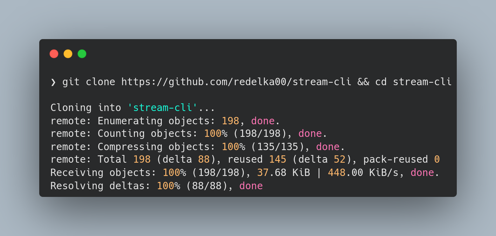
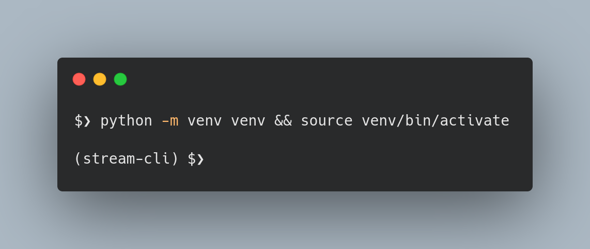
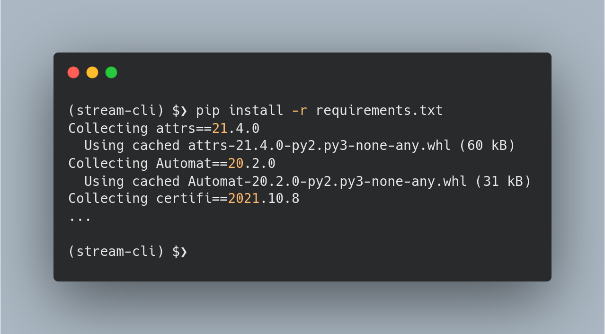
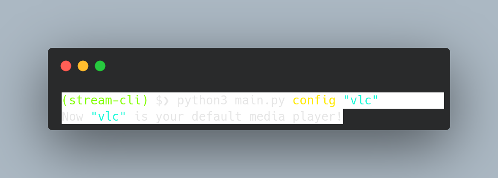
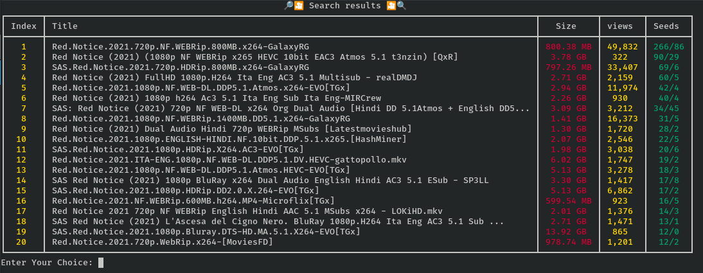

<p align="center">
  
</p>

<h2 align='center'> Stream-Cli </h2>

stream-cli is a Python scrapping CLI that combine [scrapy](https://scrapy.org) and [webtorrent](https://github.com/webtorrent/webtorrent-cli) in one command for streaming movies from your terminal.

## Installation:
> stream-cli is written in python and it depends on [webtorrent](https://github.com/webtorrent/webtorrent-cli), [NodeJS](https://nodejs.org) and [npm](https://www.npmjs.com)

1. install NodeJS on your machine ([read mode](https://nodejs.org/en/download/)).
```bash
node --version
v17.9.0 #or higher
```
2. make sure that you have npm already installed ([read more](https://docs.npmjs.com/cli/v7/configuring-npm/install)).
```bash
npm --version
8.8.0 # or higher
```
3. now let's install webtorrent ([read more](https://github.com/webtorrent/webtorrent-cli)).
```bash
npm install webtorrent-cli -g
webtorrent --version # 4.0.4 (1.8.16)
```
_Note: if not installed try with sudo privileges._

4. clone the repo in your local machine.
```bash
git clone https://github.com/redelka00/stream-cli && cd stream-cli
```


5. create a virtual environment.
* Beginner windows users who couldn't setup the [virtualenv] check this doc.
* Unix Users
```bash
python3 -m venv venv && source venv/bin/activate
```


6. Install necessary packages.
```bash
pip install -r requirements.txt
```


## Usage:
* First of all you need to setup a default player.
> Note that only [vlc](https://www.videolan.org/vlc/) and [mpv](https://mpv.io/) are supported.
```bash
python3 main.py config "vlc"
```

* If you want to get top movies:
```bash
python3 main.py top
```
* If you want to search for a specific movie (_"[red notice](https://www.imdb.com/title/tt7991608/)"_ for example):
```bash
python3 main.py search
What movie are you looking for? red notice
```

* To start watching you can just type the number of the movie in the table. 

## Contributing:
Contributions are what make the open source community such an amazing place to learn, inspire, and create. Any contributions you make are greatly appreciated.

If you have a suggestion that would make this better, please fork the repo and create a pull request. You can also simply open an issue with the tag "enhancement". Don't forget to give the project a star! Thanks again!

1. Fork the Project
2. Create your Feature Branch `git checkout -b feature/AmazingFeature`
3. Commit your Changes `git commit -m 'Add some AmazingFeature`
4. Push to the Branch `git push origin feature/AmazingFeature`
Open a Pull Request.

## Contributors❤:
<div align="center">
	<a href="https://github.com/red-elka/stream-cli/graphs/contributors">
  	
	</a>
</div>

## License:
[MIT](https://mit-license.org/)<br>
[Copyright](https://www.disclaimertemplate.net/live.php?token=xyytrgo4QtkLMNCB6LEIO6Q39YDFyhu2)


<!-- Links -->
[virtualenv]: https://github.com/redelka00/stream-cli/blob/main/docs/windowsVenv.md
